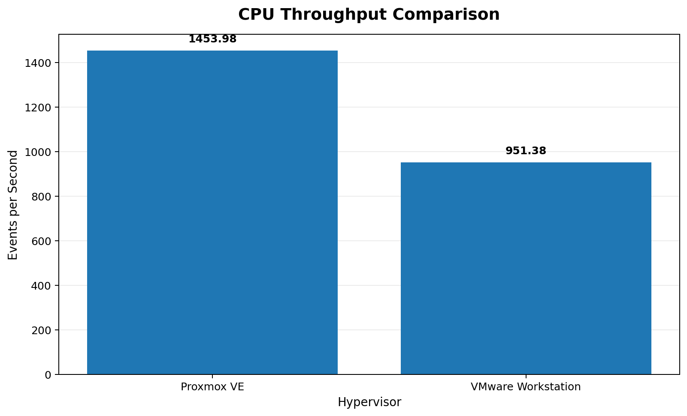
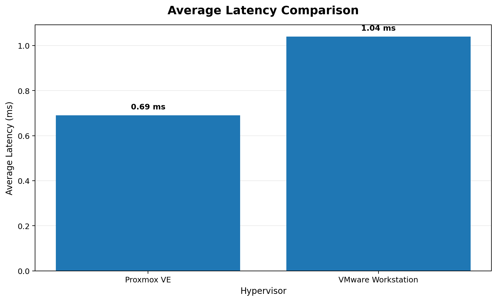
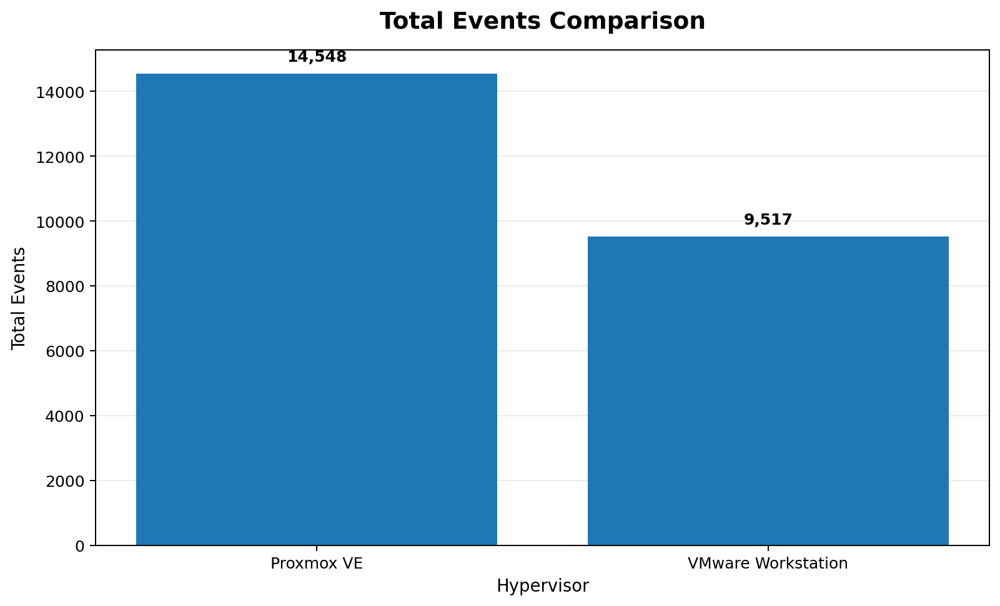
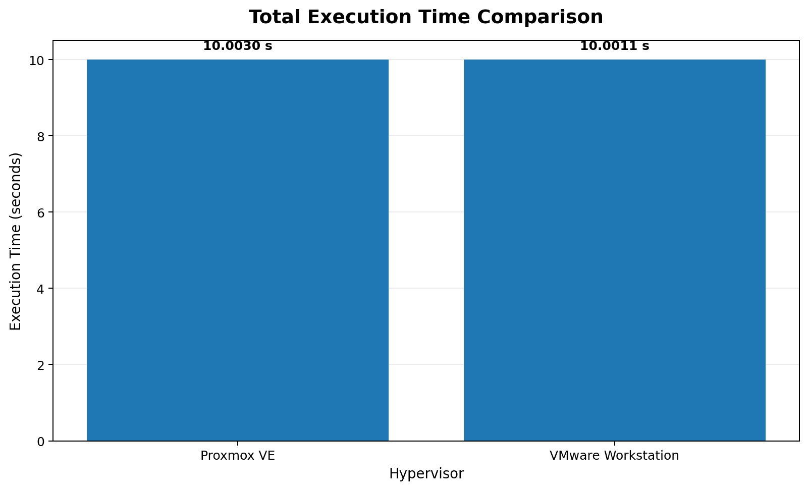
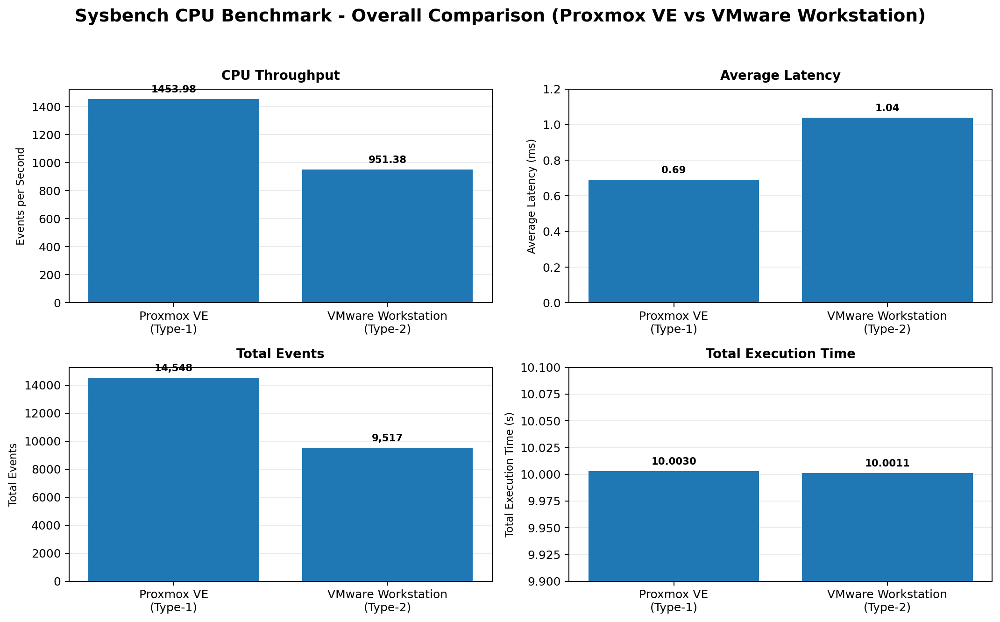

# Performance Analysis of Type-1 and Type-2 Hypervisors

**Cloud Computing Lab Experiment — Proxmox VE vs VMware Workstation**

---

## Objective

In this experiment, the same Ubuntu VM configuration was created on a Type-1 hypervisor and a Type-2 hypervisor. A Sysbench CPU benchmark was then executed on both systems and the results were compared.

---

## Hypervisors Used

- **Type-1:** Proxmox VE
- **Type-2:** VMware Workstation

Proxmox VE runs on a physical server and was accessed through a web browser. VMware Workstation runs on top of a host operating system.

---

## VM Configuration

The same configuration was used on both hypervisors:

| Configuration | Value |
|---|---|
| OS | Ubuntu |
| CPU | 2 vCPU |
| RAM | 2 GB |
| Disk | 20 GB |
| Benchmark | Sysbench |

### Sysbench Command

```bash
sysbench cpu --cpu-max-prime=20000 run
```

---

# Type-1: Proxmox VE

## Login

- Opened `https://<PROXMOX_SERVER_IP>:8006` in the browser.
- A security warning appeared because of the self-signed certificate, so **Advanced** and **Proceed** were selected.
- Logged in with the given credentials.

## VM Settings

The VM was created using the following settings:

| Setting | Value |
|---|---|
| Name | `CC-Experiment1-Type1` |
| OS | Ubuntu ISO |
| Storage | `local` |
| Disk | 20 GB (`local-lvm`) |
| CPU | 1 socket, 2 cores |
| Total vCPU | 2 |
| Memory | 2048 MiB (2 GB) |
| Network | Bridge `vmbr0` |
| System Tab | Default |

## After Creating the VM

1. Started the VM and opened the Console.
2. Installed Ubuntu and logged in.
3. Checked the VM using `hostnamectl`, `lscpu`, `free -h`, `df -h` and `top`.
4. Installed Sysbench.
5. Ran the CPU benchmark.
6. Checked CPU, memory, network and disk usage in the VM Summary page.
7. Shut down the VM using `sudo poweroff`.

### Commands Used

```bash
hostnamectl
lscpu
free -h
df -h
top
sudo apt update
sudo apt install sysbench -y
sysbench --version
sysbench cpu --cpu-max-prime=20000 run
sudo poweroff
```

## Type-1 Results — Proxmox VE

| Metric | Result |
|---|---:|
| **Total Execution Time** | **10.0030 s** |
| **Total Events** | **14548** |
| **Events per Second** | **1453.98** |
| **Minimum Latency** | **0.57 ms** |
| **Average Latency** | **0.69 ms** |
| **Maximum Latency** | **1.24 ms** |
| **95th Percentile** | **0.74 ms** |

More screenshots and details are available in the **Type-1-Proxmox** folder.

---

# Type-2: VMware Workstation

## VM Settings

VMware Workstation was opened, **Create a New Virtual Machine** was selected, and the following settings were used:

| Setting | Value |
|---|---|
| Configuration | Typical (Recommended) |
| Installer Disc Image | Ubuntu ISO |
| Guest OS | Linux, Ubuntu 64-bit |
| Name | `CC-Experiment1-Type2` |
| Disk | 20 GB |
| Memory | 2048 MB (2 GB) |
| Processors | 1 processor, 2 cores |
| Total vCPU | 2 |
| Network Adapter | NAT |

## After Creating the VM

1. Powered on the VM and installed Ubuntu.
2. Used the computer name `cc-type2-vm`.
3. Restarted and logged in.
4. Checked the VM using `hostnamectl`, `lscpu`, `free -h`, `df -h` and `top`.
5. Installed Sysbench.
6. Ran the CPU benchmark.
7. Checked the hardware settings under **VM → Settings**.
8. Shut down the VM using `sudo poweroff`.

### Commands Used

```bash
hostnamectl
lscpu
free -h
df -h
top
sudo apt update
sudo apt install sysbench -y
sysbench --version
sysbench cpu --cpu-max-prime=20000 run
sudo poweroff
```

## Type-2 Results — VMware Workstation

| Metric | Result |
|---|---:|
| **Total Execution Time** | **10.0011 s** |
| **Total Events** | **9517** |
| **Events per Second** | **951.38** |
| **Minimum Latency** | **0.95 ms** |
| **Average Latency** | **1.04 ms** |
| **Maximum Latency** | **4.24 ms** |
| **95th Percentile** | **1.10 ms** |

More screenshots and details are available in the **Type-2-VMware** folder.

---

# Performance Comparison Table

| Metric | Type-1 (Proxmox VE) | Type-2 (VMware Workstation) |
|---|---:|---:|
| **Total Execution Time** | **10.0030 s** | **10.0011 s** |
| **Total Events** | **14548** | **9517** |
| **Events per Second** | **1453.98** | **951.38** |
| **Minimum Latency** | **0.57 ms** | **0.95 ms** |
| **Average Latency** | **0.69 ms** | **1.04 ms** |
| **Maximum Latency** | **1.24 ms** | **4.24 ms** |
| **95th Percentile** | **0.74 ms** | **1.10 ms** |

---

# Observation

In this test, Proxmox VE recorded **1453.98 events per second**, while VMware Workstation recorded **951.38 events per second**.

The average latency recorded for Proxmox VE was **0.69 ms**, compared with **1.04 ms** for VMware Workstation.

Both VMs used the same basic configuration of **2 vCPU, 2 GB RAM and 20 GB disk**.

The measured differences represent the performance observed under the specific experimental conditions and hardware used for this test.

---

# Metric Explanations & Visualizations

### Total Execution Time

The amount of time taken by the Sysbench CPU test. Both tests ran for approximately 10 seconds.

### Total Events

The total number of events completed during the benchmark.

### Events per Second

The number of events completed per second. This represents the measured benchmark throughput.

### Average Latency

The average time taken to process an event during the benchmark.

---

# CPU Throughput Comparison

The graph below compares the number of Sysbench events completed per second by the two hypervisors.



### Measured Values

| Hypervisor | Events per Second |
|---|---:|
| Proxmox VE | 1453.98 |
| VMware Workstation | 951.38 |

---

# Average Latency Comparison

The graph below compares the average Sysbench latency between Proxmox VE and VMware Workstation.



### Measured Values

| Hypervisor | Average Latency |
|---|---:|
| Proxmox VE | 0.69 ms |
| VMware Workstation | 1.04 ms |

---

# Total Events Comparison

The graph below compares the total number of Sysbench events completed by each virtual machine.



### Measured Values

| Hypervisor | Total Events |
|---|---:|
| Proxmox VE | 14548 |
| VMware Workstation | 9517 |

---

# Total Execution Time Comparison

The graph below compares the total execution time of the Sysbench benchmark.



### Measured Values

| Hypervisor | Execution Time |
|---|---:|
| Proxmox VE | 10.0030 s |
| VMware Workstation | 10.0011 s |

---

# Complete Comparison Dashboard

The following dashboard provides a visual summary of the benchmark results.



---

# Technical Analysis & Discussion

Proxmox VE is a Type-1 hypervisor, while VMware Workstation is a Type-2 hypervisor.

In this experiment, Proxmox VE recorded **1453.98 events per second**, while VMware Workstation recorded **951.38 events per second**.

The average latency recorded for Proxmox VE was **0.69 ms**, compared with **1.04 ms** for VMware Workstation.

Both virtual machines used the same basic configuration of **2 vCPU, 2 GB RAM and 20 GB disk**.

The measured difference in benchmark results represents the performance observed under the specific experimental conditions and hardware used for this test.

---

# Commands Used

```bash
hostnamectl
lscpu
free -h
df -h
top
sudo apt update
sudo apt install sysbench -y
sysbench --version
sysbench cpu --cpu-max-prime=20000 run
sudo poweroff
```

---

# Conclusion

The same Ubuntu VM configuration of **2 vCPU, 2 GB RAM and 20 GB disk** was created on both Proxmox VE and VMware Workstation.

The same Sysbench CPU benchmark was executed on both virtual machines.

In this test:

- **Proxmox VE:** 1453.98 events/sec with an average latency of 0.69 ms.
- **VMware Workstation:** 951.38 events/sec with an average latency of 1.04 ms.

The results show the performance measured for both hypervisors under the configuration and test conditions used in this experiment.

---

# Repository Structure

```text
CLOUD-COMPUTING/
│
├── COMPARISON/
│   ├── README.md
│   ├── cpu_throughput.png
│   ├── average_latency.png
│   ├── total_events.png
│   ├── execution_time.png
│   └── comparison-dashboard.png
│
├── Type-1-Proxmox/
│   ├── README.md
│   └── Screenshots/
│       ├── lspuT.jpg
│       ├── free -h (2).jpg
│       └── SysbenchT1.jpg
│
└── Type-2-VMware/
    ├── README.md
    └── Screenshots/
        ├── lspu.jpg
        ├── lspu1.jpg
        ├── free -h.jpg
        ├── Sysbench.jpg
        └── sysbenchjpg.jpg
```

---

# Reproduction

To reproduce this experiment:

1. Create an Ubuntu VM with the same configuration on both a Type-1 and a Type-2 hypervisor.
2. Configure:
   - 2 vCPU
   - 2 GB RAM
   - 20 GB disk
3. Install Sysbench.
4. Run the following command on both VMs:

```bash
sysbench cpu --cpu-max-prime=20000 run
```

5. Record the benchmark results.
6. Compare the performance metrics.

---

<p align="center">
<b>Cloud Computing Laboratory</b>
</p>

<p align="center">
<i>Performance Analysis of Type-1 and Type-2 Hypervisors</i>
</p>
